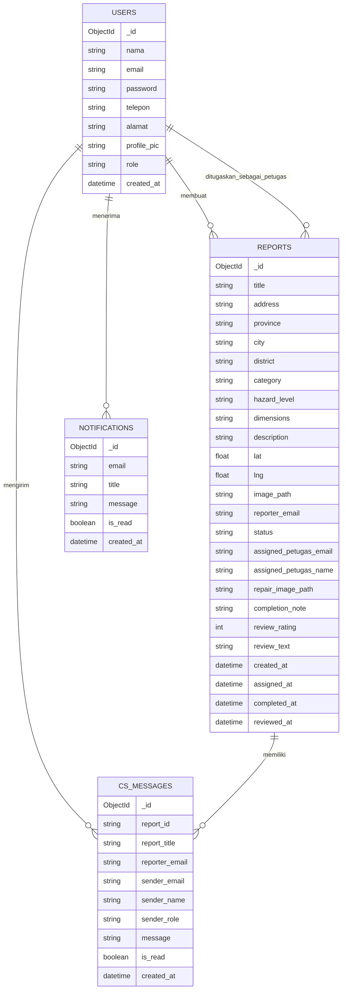
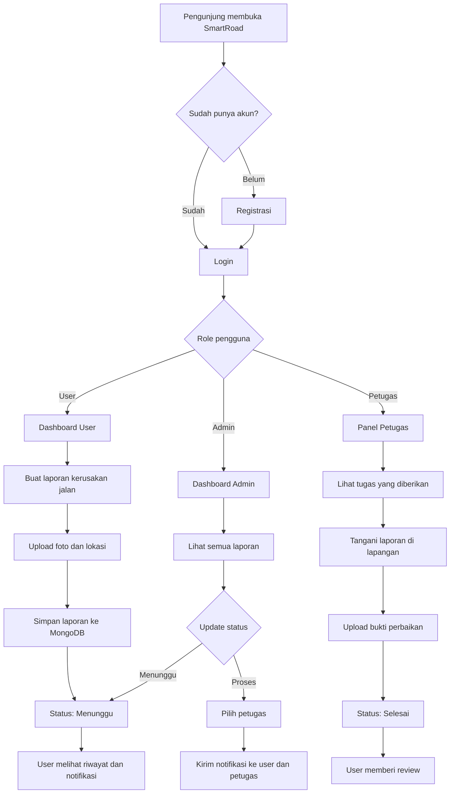
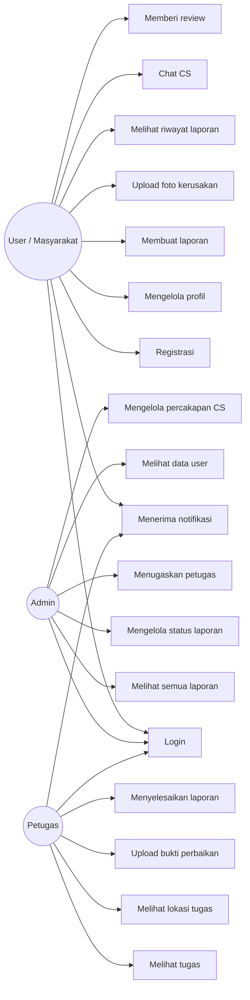
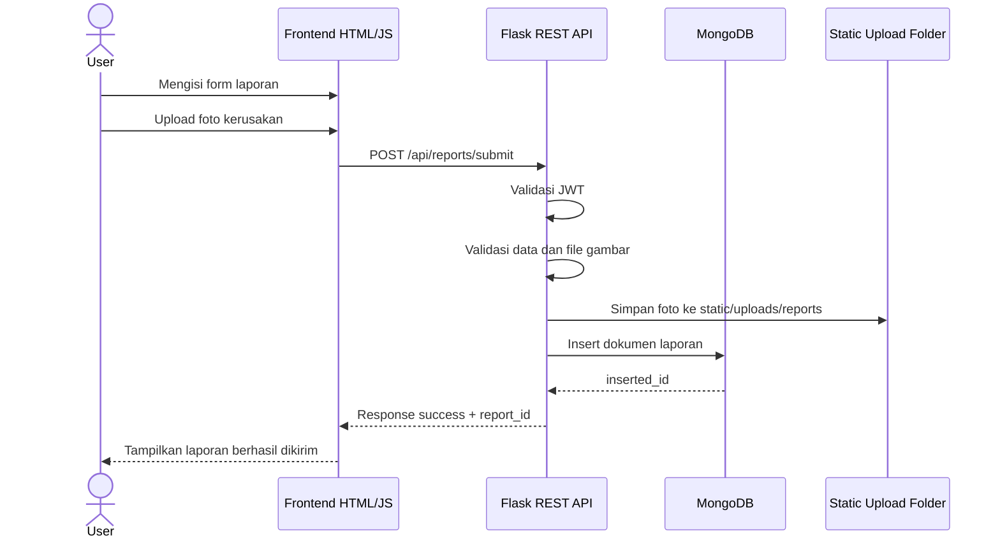
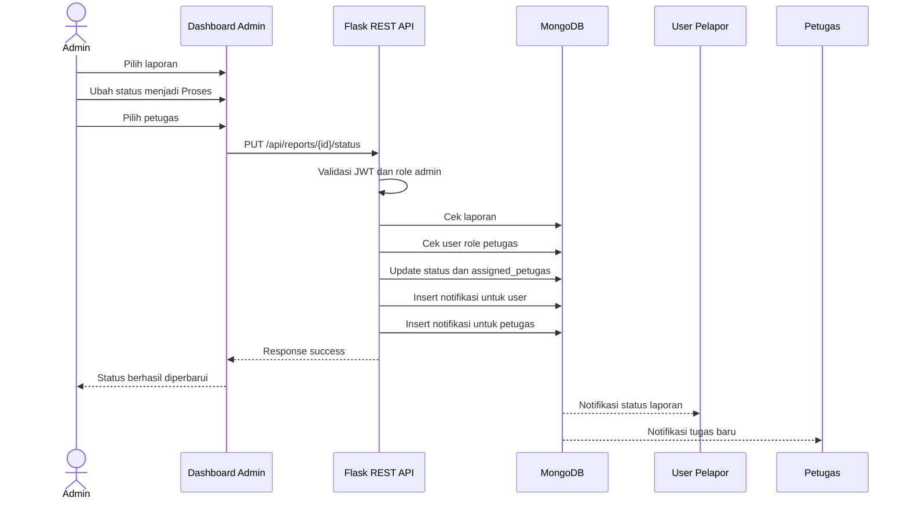
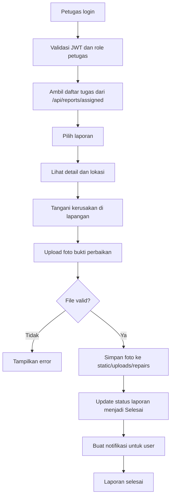
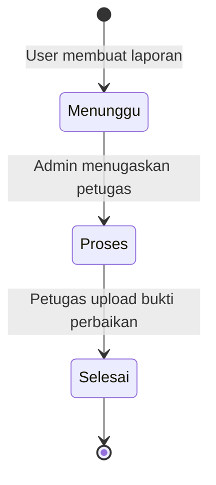

# SmartRoad

## Sistem Pelaporan Kerusakan Jalan Berbasis Web

SmartRoad adalah aplikasi web untuk membantu masyarakat melaporkan kerusakan jalan secara digital. Sistem ini menyediakan alur pelaporan, pemantauan status, penugasan petugas, bukti perbaikan, notifikasi, chat customer service, dan dashboard admin.

Aplikasi ini dibangun dengan backend **Python Flask**, database **MongoDB**, autentikasi **JWT**, serta frontend berbasis **HTML, CSS, dan JavaScript**.

---

## Latar Belakang

Kerusakan jalan seperti jalan berlubang, retak, banjir, lampu jalan mati, marka rusak, atau pohon tumbang dapat mengganggu aktivitas masyarakat dan membahayakan pengguna jalan.

Proses pelaporan manual sering lambat, sulit dipantau, dan tidak terdokumentasi dengan baik. SmartRoad dibuat untuk mempermudah masyarakat mengirim laporan, membantu admin memverifikasi dan menugaskan petugas, serta memberi transparansi status penanganan.

---

## Tujuan Sistem

- Mempermudah masyarakat melaporkan kerusakan jalan.
- Menyediakan data laporan yang rapi dan terdokumentasi.
- Membantu admin memantau dan mengelola laporan.
- Membantu petugas lapangan menerima tugas perbaikan.
- Memberikan transparansi status laporan kepada pelapor.

---

## Pengguna Sistem

### 1. User / Masyarakat

User dapat:

- Registrasi dan login.
- Mengisi dan mengirim laporan kerusakan jalan.
- Mengunggah foto bukti kerusakan.
- Menentukan lokasi laporan.
- Melihat riwayat laporan.
- Melihat status laporan.
- Menerima notifikasi update laporan.
- Mengirim chat CS terkait laporan.
- Memberikan review setelah laporan selesai.
- Mengelola profil, password, dan foto profil.

### 2. Admin

Admin dapat:

- Melihat seluruh laporan.
- Melihat data user dan petugas.
- Mengubah status laporan.
- Menugaskan laporan kepada petugas.
- Melihat dashboard monitoring.
- Mengelola percakapan CS dengan user.

### 3. Petugas

Petugas dapat:

- Melihat laporan yang ditugaskan.
- Melihat lokasi dan detail tugas.
- Mengunggah foto bukti perbaikan.
- Menyelesaikan laporan yang sudah ditangani.
- Menerima notifikasi tugas baru.

---

## Teknologi yang Digunakan

### Backend

- Python
- Flask
- Flask-CORS
- Flask-JWT-Extended
- PyMongo
- bcrypt
- python-dotenv

### Frontend

- HTML5
- CSS3
- JavaScript
- Tailwind CSS pada dashboard admin
- Bootstrap-style/custom CSS pada beberapa halaman
- SweetAlert2
- Lucide Icons
- Font Awesome

### Database

- MongoDB
- Database default: `smartroad_db`
- URI default: `mongodb://localhost:27017/`

### Maps dan Visualisasi

- Leaflet.js
- OpenStreetMap/CARTO tile layer
- Chart.js pada dashboard admin

### Upload File

- Foto profil: `static/uploads/`
- Foto laporan: `static/uploads/reports/`
- Foto bukti perbaikan: `static/uploads/repairs/`
- Format gambar yang didukung: JPG, JPEG, PNG, WEBP
- Ukuran maksimal gambar: 5 MB

---

## Arsitektur Aplikasi

```text
User / Admin / Petugas
        |
        v
Frontend HTML, CSS, JavaScript
        |
        v
REST API Flask
        |
        v
MongoDB
```

Backend menyediakan REST API dengan response JSON. Frontend mengambil dan mengirim data menggunakan `fetch()` serta token JWT dari `sessionStorage`.

---

## Diagram Sistem

Bagian ini menggunakan sintaks **Mermaid**. Jika Markdown viewer mendukung Mermaid, diagram akan tampil otomatis.

### 1. ERD Database



### 2. Flowchart Alur Sistem



### 3. Use Case Diagram



### 4. Sequence Diagram Pembuatan Laporan



### 5. Sequence Diagram Update Status dan Penugasan Petugas



### 6. Activity Diagram Petugas Menyelesaikan Laporan



### 7. State Diagram Status Laporan



---

## Struktur Project

```text
smartroad/
|-- run.py
|-- requirements.txt
|-- README.md
|-- create_admin.py
|-- create_petugas.py
|
|-- app/
|   |-- __init__.py
|   |-- db.py
|   |
|   |-- routes/
|   |   |-- auth_routes.py
|   |   |-- profile_routes.py
|   |   |-- report_routes.py
|   |   |-- admin_routes.py
|   |   `-- view_routes.py
|   |
|   |-- controllers/
|   |   |-- auth_controller.py
|   |   |-- profile_controller.py
|   |   `-- report_controller.py
|   |
|   `-- utils/
|       `-- decorators.py
|
|-- templates/
|   |-- index.html
|   |-- login.html
|   |-- register.html
|   |-- dashboard.html
|   |-- dashboard-admin.html
|   |-- laporan.html
|   |-- riwayat.html
|   |-- profile.html
|   `-- petugas.html
|
|-- static/
|   |-- js/
|   |-- uploads/
|   |   |-- reports/
|   |   `-- repairs/
|
|-- css/
|-- js/
`-- components/
```

---

## Konfigurasi Aplikasi

File utama untuk menjalankan aplikasi:

```text
run.py
```

Konfigurasi penting:

```python
app.run(host='0.0.0.0', port=5000, debug=True, use_reloader=False)
```

Environment variable yang dapat digunakan:

```text
MONGO_URI=mongodb://localhost:27017/
JWT_SECRET_KEY=isi-secret-key-anda
```

Jika environment variable tidak tersedia, aplikasi memakai default:

```text
MONGO_URI=mongodb://localhost:27017/
JWT_SECRET_KEY=smartroad-dev-only-change-me
```

---

## Instalasi dan Menjalankan Project

### 1. Install dependency

```bash
pip install -r requirements.txt
```

### 2. Pastikan MongoDB berjalan

MongoDB harus aktif di lokal atau URI yang ditentukan melalui `MONGO_URI`.

### 3. Jalankan aplikasi

```bash
python run.py
```

Aplikasi berjalan di:

```text
http://127.0.0.1:5000
```

---

## Halaman Web

| Halaman | Fungsi |
| --- | --- |
| `/` atau `/index.html` | Landing page publik SmartRoad |
| `/login.html` | Login user/admin/petugas |
| `/register.html` | Registrasi user |
| `/dashboard.html` | Dashboard user |
| `/laporan.html` | Form pembuatan laporan |
| `/riwayat.html` | Riwayat laporan user |
| `/profile.html` | Pengaturan profil user |
| `/dashboard-admin.html` | Dashboard admin |
| `/petugas.html` | Panel petugas lapangan |

---

## Endpoint API

### Auth

| Method | Endpoint | Fungsi |
| --- | --- | --- |
| POST | `/api/auth/register` | Registrasi user baru |
| POST | `/api/auth/login` | Login dan mendapatkan JWT |

### Profile

Endpoint berikut membutuhkan JWT.

| Method | Endpoint | Fungsi |
| --- | --- | --- |
| GET | `/api/profile/user-profile` | Mengambil data profil user |
| POST | `/api/profile/update-profile` | Memperbarui nama, telepon, dan alamat |
| POST | `/api/profile/update-password` | Mengganti password |
| POST | `/api/profile/upload-photo` | Mengunggah foto profil |

### Reports

| Method | Endpoint | Hak Akses | Fungsi |
| --- | --- | --- | --- |
| GET | `/api/reports/public-summary` | Publik | Ringkasan laporan untuk landing page |
| POST | `/api/reports/submit` | User login | Membuat laporan baru |
| GET | `/api/reports/user` | User login | Mengambil laporan milik user |
| GET | `/api/reports/all` | Admin | Mengambil seluruh laporan |
| PUT | `/api/reports/<report_id>/status` | Admin | Mengubah status laporan |
| GET/POST | `/api/reports/<report_id>/cs-messages` | User/Admin | Melihat atau mengirim chat CS |
| GET | `/api/reports/cs/conversations` | Admin | Daftar percakapan CS |
| GET | `/api/reports/assigned` | Petugas | Mengambil tugas petugas |
| POST | `/api/reports/<report_id>/complete` | Petugas | Menyelesaikan laporan dengan bukti perbaikan |
| POST | `/api/reports/<report_id>/review` | User login | Memberikan review setelah laporan selesai |
| GET | `/api/reports/notifications/user` | User login | Mengambil notifikasi |
| PUT | `/api/reports/notifications/user/read` | User login | Menandai notifikasi sudah dibaca |

### Admin

Endpoint berikut membutuhkan JWT dengan role `admin`.

| Method | Endpoint | Fungsi |
| --- | --- | --- |
| GET | `/api/admin/dashboard-stats` | Statistik dashboard admin |
| GET | `/api/admin/users` | Data seluruh user tanpa password |
| GET | `/api/admin/petugas` | Data user dengan role petugas |

---

## Role dan Proteksi Akses

Sistem menggunakan JWT yang menyimpan role user di claims.

Role yang digunakan:

```text
user
admin
petugas
```

Proteksi backend:

- `@jwt_required()` memastikan endpoint hanya dapat diakses oleh user yang memiliki token.
- `@admin_required()` memastikan endpoint hanya dapat diakses admin.
- `@petugas_required()` memastikan endpoint hanya dapat diakses petugas.

Proteksi frontend ada di:

```text
static/js/auth-guard.js
```

File tersebut mengecek token dan role di `sessionStorage`, lalu mengarahkan user ke `login.html` jika tidak sesuai.

---

## Alur Sistem

### Alur User

```text
1. User registrasi atau login.
2. User membuat laporan kerusakan jalan.
3. User mengunggah foto dan lokasi laporan.
4. Laporan tersimpan di MongoDB dengan status Menunggu.
5. User dapat melihat laporan di halaman riwayat.
6. User menerima notifikasi jika status berubah.
7. User dapat chat dengan admin/CS.
8. User memberi review setelah laporan selesai.
```

### Alur Admin

```text
1. Admin login.
2. Admin membuka dashboard admin.
3. Admin melihat seluruh laporan masuk.
4. Admin mengubah status laporan.
5. Jika status menjadi Proses, admin memilih petugas.
6. Sistem mengirim notifikasi ke user dan petugas.
7. Admin dapat membalas chat CS dari user.
```

### Alur Petugas

```text
1. Petugas login.
2. Petugas membuka panel petugas.
3. Petugas melihat daftar tugas yang ditugaskan.
4. Petugas menangani laporan di lapangan.
5. Petugas mengunggah foto bukti perbaikan.
6. Sistem mengubah status laporan menjadi Selesai.
7. User menerima notifikasi laporan selesai.
```

---

## Struktur Data MongoDB

### Collection `users`

Contoh field:

```json
{
  "_id": "ObjectId",
  "nama": "Nama User",
  "email": "user@example.com",
  "password": "bcrypt_hash",
  "telepon": "",
  "alamat": "",
  "profile_pic": "default-profile.png",
  "role": "user",
  "created_at": "datetime"
}
```

### Collection `reports`

Contoh field:

```json
{
  "_id": "ObjectId",
  "title": "Jalan Berlubang",
  "address": "Alamat lokasi",
  "province": "Provinsi",
  "city": "Kota/Kabupaten",
  "district": "Kecamatan",
  "category": "Jalan Berlubang",
  "hazard_level": "Tinggi",
  "dimensions": "Ukuran kerusakan",
  "description": "Deskripsi laporan",
  "lat": -6.2,
  "lng": 106.8,
  "image_path": "uploads/reports/nama-file.jpg",
  "reporter_email": "user@example.com",
  "status": "Menunggu",
  "assigned_petugas_email": "petugas@example.com",
  "assigned_petugas_name": "Nama Petugas",
  "repair_image_path": "uploads/repairs/nama-file.jpg",
  "completion_note": "Catatan penyelesaian",
  "review_rating": 5,
  "review_text": "Ulasan user",
  "created_at": "datetime",
  "assigned_at": "datetime",
  "completed_at": "datetime",
  "reviewed_at": "datetime"
}
```

### Collection `notifications`

Contoh field:

```json
{
  "_id": "ObjectId",
  "email": "user@example.com",
  "title": "Update Status Laporan",
  "message": "Status laporan telah diubah",
  "is_read": false,
  "created_at": "datetime"
}
```

### Collection `cs_messages`

Contoh field:

```json
{
  "_id": "ObjectId",
  "report_id": "id laporan",
  "report_title": "Judul laporan",
  "reporter_email": "user@example.com",
  "sender_email": "admin@example.com",
  "sender_name": "Admin CS",
  "sender_role": "admin",
  "message": "Isi pesan",
  "is_read": false,
  "created_at": "datetime"
}
```

---

## Status Laporan

Status laporan yang digunakan backend:

```text
Menunggu
Proses
Selesai
```

Penjelasan:

- `Menunggu`: laporan baru masuk dan belum ditugaskan.
- `Proses`: laporan sedang ditangani dan sudah ditugaskan ke petugas.
- `Selesai`: laporan sudah diselesaikan oleh petugas dengan bukti foto perbaikan.

---

## Keamanan dan Validasi

- Password user disimpan dalam bentuk hash `bcrypt`.
- API penting dilindungi JWT.
- Endpoint admin dan petugas dilindungi role.
- Upload gambar divalidasi berdasarkan ekstensi, MIME type, dan ukuran.
- File upload diberi nama unik menggunakan timestamp.
- Password lama harus benar sebelum user dapat mengganti password.

---

## File Penting

| File | Fungsi |
| --- | --- |
| `run.py` | Entry point aplikasi Flask |
| `app/__init__.py` | Membuat app, konfigurasi CORS/JWT, register blueprint |
| `app/db.py` | Koneksi MongoDB |
| `app/routes/auth_routes.py` | Route auth |
| `app/routes/profile_routes.py` | Route profil |
| `app/routes/report_routes.py` | Route laporan, notifikasi, review, CS, petugas |
| `app/routes/admin_routes.py` | Route admin |
| `app/routes/view_routes.py` | Route render halaman HTML |
| `app/controllers/auth_controller.py` | Logic register dan login |
| `app/controllers/profile_controller.py` | Logic profil dan upload foto profil |
| `app/controllers/report_controller.py` | Logic laporan, status, tugas, notifikasi, chat, review |
| `app/utils/decorators.py` | Decorator role admin dan petugas |

---

## Kesimpulan

SmartRoad adalah aplikasi web pelaporan kerusakan jalan yang menghubungkan masyarakat, admin, dan petugas lapangan. Sistem ini menggunakan Flask sebagai REST API backend, MongoDB sebagai database, JWT untuk autentikasi, dan frontend HTML/CSS/JavaScript untuk antarmuka pengguna.

Dengan fitur laporan, upload foto, status progres, dashboard admin, penugasan petugas, notifikasi, chat CS, dan review, SmartRoad membantu proses pelaporan dan penanganan kerusakan jalan menjadi lebih terstruktur dan transparan.
